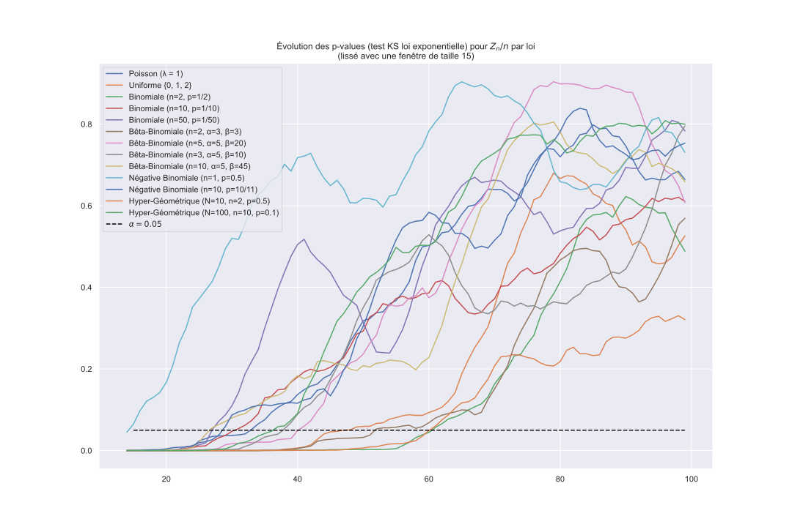

# Epidemic simulation

Epidemic simulation with Galton-Watson model

# Folder organization

[`📂 assets`](assets)
> Resources related to the project, like images.

[`📂 data`](data)
> Kickstarter projects data.

[`📂 docs`](docs)
> Project documentation and example notebooks.

[`📂 src`](src)
> Project source code.
